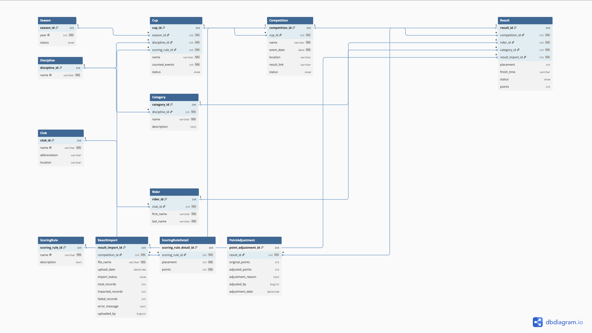

# Entity Relationship (ER) Diagram

## Purpose

This document contains the Entity Relationship (ER) diagrams for the cycling cup system database.

The diagrams show:  
* Database entities
* Primary keys
* Foreign keys
* One-to-many relationships

